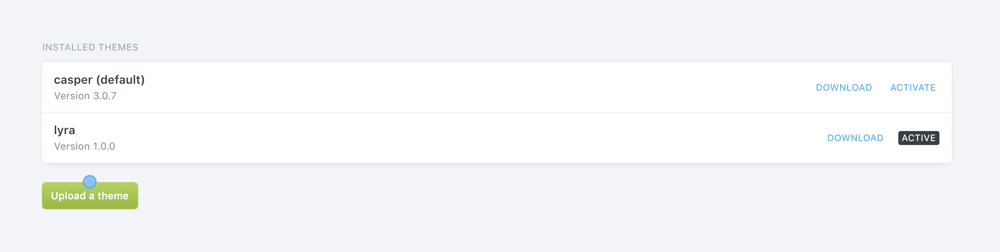
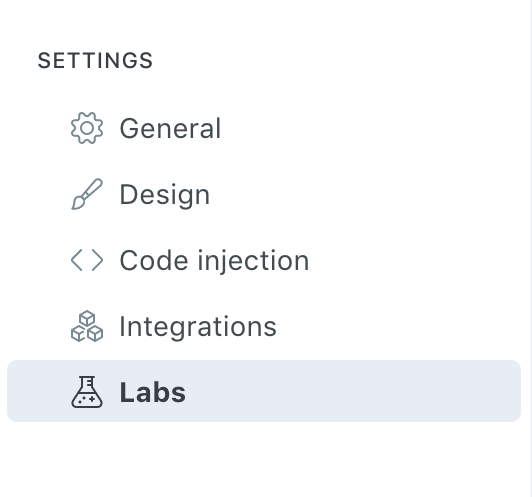
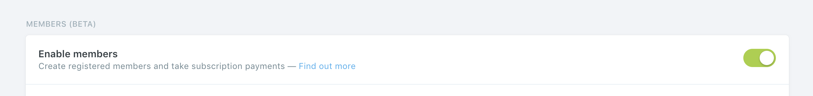

# Having fun with Ghost 

For MacOS + Linux. You'll need:

+ [npm](https://www.npmjs.com/get-npm)
+ [yarn](https://classic.yarnpkg.com/en/docs/install)
+ [git](https://git-scm.com/downloads)

## Set it up locally

Install [nvm](https://github.com/nvm-sh/nvm) to use [a compatible version](https://ghost.org/faq/node-versions/) of node.js in a development environment:

```
$ curl -o- https://raw.githubusercontent.com/nvm-sh/nvm/v0.35.2/install.sh | bash
$ nvm install 10.13.0
```

From this [guide](https://ghost.org/docs/install/local/), install the `ghost` command:

```
npm install ghost-cli@latest -g
```

Enter a development environment with node v10.13.0:

```
$ nvm use node
```

Setup a demo ghost site in this directory:

```
$ ghost install local
```

Go to the URL shown in your terminal. Voila! A test site using the default [Casper](https://github.com/TryGhost/Casper) theme ([example](https://demo.ghost.io/)).

## Demo memberships

Go where themes are installed:

```
$ cd content/themes
$ ls
casper
```

Download [Lyra](https://github.com/TryGhost/Lyra), the open source membership site theme:

```
$ git clone https://github.com/TryGhost/Lyra.git
```

Build the theme (rewrites the CSS):

```
$ cd Lyra
$ yarn
```

Restart your local ghost server to pick up the new theme:

```
$ ghost restart
```

Go to the Design tab and activate Lyra:




Go to the Labs tab and enable members:





Still in the Labs tab, click "Upload routes YAML" and upload `content/themes/Lyra/routes.yaml`:


You should now see a subscribe button in the top-right corner and "Free Post" on the content! [Explore more](https://ghost.org/docs/members/requirements/)

## Change the design

Constantly watch the Lyra theme for changes:

```
$ cd content/themes/Lyra
$ yarn dev
```

Open `index.hbs` (defines the homepage) and simplify the header:

```html
<header class="site-home-header">
    <div class="inner">
    	  {{> "site-nav"}}
    </div>
</header>
```

View the site again and you should see the ghost logo and description disappear, with just the navigation bar remaining!

This is an example of a small change you can make. Dig into [this](https://ghost.org/docs/api/v3/handlebars-themes/structure/) to learn how to change anything about the site.
